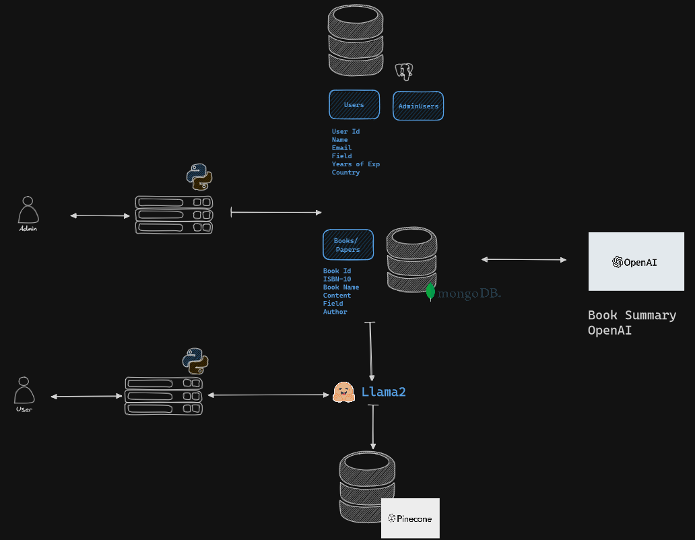
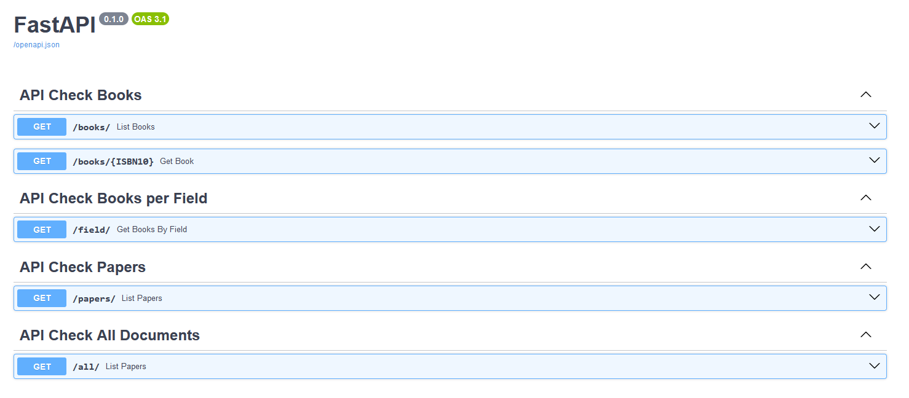

# Personal Brain Project

## Overview
Welcome to the **Personal Brain Project** - your digital repository for technical knowledge! This innovative platform leverages the power of Retrieval-Augmented Generation (RAG) to provide insightful summaries and answer questions about technical papers and books. 

Whether you are a researcher, a student, or simply a knowledge enthusiast, the Personal Brain Project is designed to enhance your learning experience by making information retrieval seamless and interactive.

## Features
- **Data Ingestion**: Add your technical papers and books to the brain using our Streamlit-based interface or directly via the API.
- **Intelligent Retrieval**: Powered by MongoDB and Postgres, retrieve your documents in an instant.
- **Smart Summarization**: Get concise summaries of lengthy documents, thanks to OpenAI's cutting-edge language models.
- **Interactive Q&A**: Ask complex questions and receive accurate answers generated by our RAG system.
- **Robust API**: Built with FastAPI and Pydantic, expect high-performance interactions with strong typing.

## API Overview

## The Journey
The project is more than just an application; it's a culmination of various technologies knit together to create a robust and intelligent system. We've utilized:
- **FastAPI** for speedy backend services.
- **Streamlit** for an intuitive frontend experience.
- **OpenAI's LLM** for state-of-the-art language understanding.
- **MongoDB** for flexible data storage.
- **Postgres** for structured data management.
- **Pydantic** for data validation.

Our journey in building the Personal Brain Project has been filled with learning and achievement. It stands as a testament to what modern technology can accomplish when directed towards the goal of knowledge management and dissemination.

## Get Started
To get started with the Personal Brain Project:
1. Clone the repository.
2. Install dependencies from `requirements.txt`.
3. Follow the setup instructions in the documentation to initialize the databases.
4. Launch the application and start adding content to your personal brain!

## Contribute
This project thrives on community contributions. Whether it's adding features, improving the UI, or enhancing the RAG capabilities, we welcome your pull requests!

## License
The Personal Brain Project is released under the MIT license. Feel free to fork, modify, and use it in your own projects.

## Acknowledgements
Special thanks to the open-source projects and APIs that made this project possible.

Embark on your journey towards a smarter way of learning and information retrieval with the Personal Brain Project today!
